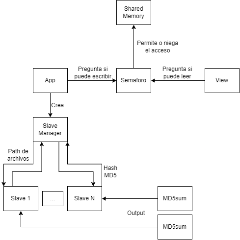

# Trabajo Práctico Especial - SO 2023

## Tabla de contenidos

- [Requerimientos](#requerimientos)
- [GitFlow](#gitflow)
  - [Inicializando un gitflow repo](#inicializando-un-gitflow-repo)
  - [Manejando ramas](#manejando-ramas)
- [Compilando](#compilando)
- [Problemas encontrados](#problemas-encontrados)
  - [Shared Memory](#shared-memory)
  - [Punteros en memoria compartida](#punteros-en-memoria-compartida)
  - [Uso de select](#uso-de-select)
- [Decisiones tomadas](#decisiones-tomadas)
  - [TADs](#tads)
  - [Organización](#organizacion)
- [Limitaciones](#limitaciones)
- [Código reutilizado](#codigo-reutilizado)
- [Diagrama](#diagrama)

## Requerimientos

Para el trabajo en cuestión se estarán utilizando los siguientes componentes:

- [gitflow plugin](https://github.com/nvie/gitflow)
- docker

El plugin de gitflow (explicado en [GitFlow](#gitflow)) permite manejar los branch de `git` de una forma más sencilla que la habitual, siguiendo la filosofía del modelado de ramas de [gitflow](https://nvie.com/posts/a-successful-git-branching-model/).

## GitFlow

Para instalar `gitflow` simplemente se necesita usar el _package manager_ de la distribución en la que trabajes:

**Para Ubuntu o Debian**

```bash
$ apt install git-flow
```

**Para Arch**

```bash
$ yay -S gitflow-avh
```

`gitflow` se basa en la creación de ramas promoviendo una separación entre **desarrollo** (_develop_) y **lanzamientos** (_releases_), utilizando ramificaciones de _features_ cortos que se mergean a la rama de desarrollo.

Para simplificar el manejo de dichas ramas, dicho plugin para git crea comandos que resumen una serie de pasos para asegurarse la mejor implementación de dicho modelado.

### Inicializando un gitflow repo

Para inicializar el modelado de gitflow en el repositorio actual debemos correr alguno de los siguientes comandos:

```bash
$ git flow init
$ git flow init -d  # toma los valores por default
```

### Manejando ramas

Ahora para el manejo de todas las ramas y del repo en general, transcribo del [README de gitflow](https://github.com/nvie/gitflow/blob/develop/README.mdown), el manual de como manejar las ramas.

- To list/start/finish feature branches, use:

  ```bash
  git flow feature
  git flow feature start <name> [<base>]
  git flow feature finish <name>
  ```

  For feature branches, the `<base>` arg must be a commit on `develop`.

- To push/pull a feature branch to the remote repository, use:

  ```bash
  git flow feature publish <name>
  git flow feature pull <remote> <name>
  ```

- To list/start/finish release branches, use:

  ```bash
  git flow release
  git flow release start <release> [<base>]
  git flow release finish <release>
  ```

  For release branches, the `<base>` arg must be a commit on `develop`.

- To list/start/finish hotfix branches, use:

  ```bash
  git flow hotfix
  git flow hotfix start <release> [<base>]
  git flow hotfix finish <release>
  ```

  For hotfix branches, the `<base>` arg must be a commit on `master`.

- To list/start support branches, use:
  ```bash
  git flow support
  git flow support start <release> <base>
  ```
  For support branches, the `<base>` arg must be a commit on `master`.

## Compilando

Para compilar el proyecto es tan sencillo como correr el script `compile.sh` que se encarga del manejo de la imágen de docker para compilar el proyecto igual para cualquiera que haya clonado el presente repositorio.

```bash
$ ./compile.sh
```

## Problemas encontrados

### Shared memory

Al estar investigando acerca del tema de "_shared memory_", pudimos entender varios aspectos del tema. Implementarlo en el proyecto no tuvo mucho problema más que utilizamos las syscalls que quedaron obsoletas con el paso del tiempo, como pueden ser "_shmget_", "_shmat_" o "_shmdt_". Por esta razón, tuvimos que cambiar las funciones creadas y usar syscalls tales como "_shmopen_" y "_mmap_", que por lo que entendimos son el estándar de hoy en día.

El verdadero problema, vino al implementar los semáforos. Cuando incluimos los semáforos en el código descubrimos un gran problema al ejecutar la vista, este programa nunca termina. Como el proceso vista solo recibe la información necesaria para conectarse a la "_shared memory_" por entrada estándar no tenemos manera de decirle a el proceso vista cuando ya no hay más archivos para leer. Al ejecutar el programa, podíamos apreciar como había un buen funcionamiento de la shared memory entre el proceso aplicación y el proceso vista, pero cuando terminaba de imprimir los archivos, el proceso aplicación terminaba su ejecución y el proceso vista se queda esperando en el semáforo por el siguiente elemento.

Nuestra primera solución a esto fue investigar la API de semáforos POSIX. Investigando, encontramos "sem_timedwait" la cual hace la espera como el semáforo que habíamos incluido anteriormente y si en un rango de tiempo (programado) el semáforo no cambia de valor, inmediatamente se termina este proceso, lo cual permite que el proceso visto pueda terminar su ejecución. Esta solución no es la correcta ya que no funciona en todos los casos. Si da la casualidad de que todos los procesos esclavos estén trabajando en un archivo muy grande, estos pueden llegar a tardar mucho tiempo lo cual llevaría a el proceso vista a terminar antes de lo debería

La solución final que implementamos fue incluir un "_end of file_" en el TAD del semáforo. Por lo tanto, el proceso aplicación modificara este "_end of file_" cuando allá terminado de trabajar con todos los archivos disponibles, y el proceso vista chequea en cada iteración antes de esperar en el semáforo si este "_end of file_" fue modificado o no.


### Punteros en memoria compartida

Al declarar el TAD de la "_shared memory_" teníamos un error que no nos permitía destruir o desincronizar el bloque de memoria creado anteriormente. Tras mucho "_debugging_" descubrimos que le problema yacía dentro de la declaración de nuestra variable "_path_" dentro del TAD, la cual anteriormente era declarada como puntero. Como era declarado como puntero, al crear la memoria compartida se guardaba el valor "_path_" recibido por parámetro de esta manera. Esto es un error ya que se guardaba este parámetro de manera que apuntara a una dirección de memoria de un proceso especifico. Al querer borrar o cerrar la conexión con la memoria compartido, lanzaba un error, ya que el puntero no correspondía. La solución fue declarar esta variable como un array estático y de esta manera solucionar los errores y poder desacoplar la conexión a la memoria compartido y luego borrar el bloque.


### Uso de select

Más en el comienzo del desarrollo, tuvimos un problema con el uso de 'select', el programa quedaba colgado en el select. Resulta que el slave no estaba escribiendo sus resultados correctamente en el pipe, printf no lograba escribir en el fd 1 (que estaba mapeado al pipe). Finalmente logramos solucionarlo mediante setvbuffer().

## Decisiones tomadas

### TADs

Una de las decisiones más importantes que tomamos a principio del proyecto fue trabajar con dos TADs (Tipos Abstractos de Datos). Creamos dos TADs, uno para guardar la información de los esclavos y otro para la información de la memoria compartida. Al crear las librerías, tanto "_slave manager_" como "_shm lib_", se facilita mucho la modularización del código y, al crear los "_struct_" que agrupen tantas variables, el código queda mucho más limpio y agradable a la vista. También se facilita el pasaje y recibo de parámetros en diversas funciones debido a que se puede enviar y recibir la estructura como parámetro y no estar pasando parámetros individualmente.

### Organización

Como el trabajo practico estaba dividido muy estrictamente en partes (la aplicación, los esclavos y la vista), decidimos entre el grupo separar estas tareas para un avance más rápido y seguro del proyecto. Esto permitió a cada integrante del grupo realizar su parte en el proyecto sin mucha necesidad de comunicación entre nosotros. Ahora sí, llegando al final del proyecto nos comunicamos entre nosotros para resolver la comunicación entre cada una de las partes. De esta manera pudimos conectar cada una de las partes tomando muchas decisiones menores a lo largo del camino.

## Limitaciones

En cuanto a limitaciones del proyecto, simplemente tuvimos muy en cuenta lo pedido por el trabajo practico. Al leer en varias ocasiones la consigna del primer trabajo practico de la materia, notamos que todo estaba detalladamente explicado como lo deberíamos resolver, dejando pocas decisiones para tomar (mayormente en cuanto a la estructura del código). Al tener tantos puntos en consideraciones, se limita las posibilidades que teníamos para resolver varios problemas, ya que ciertas soluciones a problemas encontrados en el proyecto podían realizar un conflicto con otros puntos pedidos por el trabajo practico. De esta manera, dejaba pocas posibilidades para cumplir con todas las necesidades o aspectos que pedía el trabajo practico.

## Código reutilizado

No utilizamos ninguna fuente externa aparte del "_man page_". Basamos partes de nuestro código en los ejemplos que proporciona este "_man page_", más notablemente, para la realización de la librería de "_shared memory_" tomamos mucha inspiración del código de ejemplo que proporciona acerca de "_shmopen_".

## Diagrama


